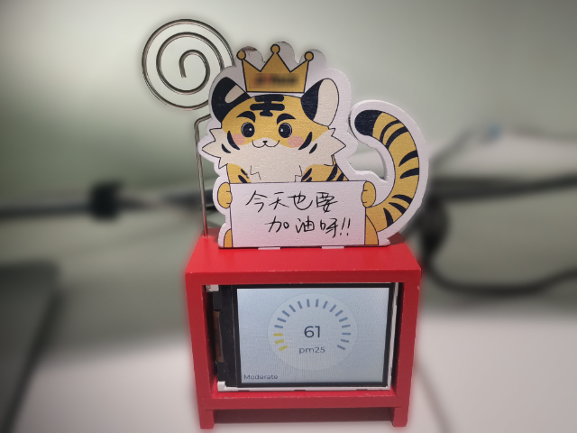
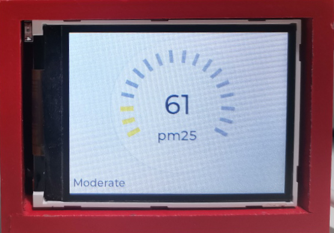

# ESP32 AQI(Air Quality Index) Monitor

This device was used to display the outdoor air quality index in real time, and the data was obtained from the (aqicn.org) website.

## Motivation

Commercially available air quality indicators can only display indoor air quality (via the built-in PM2.5 sensor). And the data sources used by AQI apps on mobile phones are often inaccurate. I need a lightweight embedded device to display outdoor air quality in real time. It's size is similar to  commercial digital indicating clock, powered by 5V USB interface which can be connected to my LCD monitor. It should have its own network connection which means it can be used without a PC or mobile phone.

## Implement

The device is modified from commercially available wooden desktop calendar ornaments which is available in [Taobao](https://detail.tmall.com/item.htm?spm=a230r.1.14.263.756d3497nVpTEa&id=618054865500&ns=1&abbucket=13&skuId=4563777303351) or [aliexpress](https://www.aliexpress.com/item/1005003527356996.html?spm=a2g0o.productlist.0.0.76192a93Jooexb&algo_pvid=e1af4959-7f4f-4dff-9664-42961a090648&algo_exp_id=e1af4959-7f4f-4dff-9664-42961a090648-39&pdp_ext_f=%7B%22sku_id%22%3A%2212000026179537743%22%7D&pdp_pi=-1%3B8.85%3B-1%3B-1%40salePrice%3BUSD%3Bsearch-mainSearch). It uses ESP32-C3 WIFI module as microcontroller and a 2.4-inch TFT LCD screen(ST7789) as display output.Since the ESP32-C3 module has a built-in WIFI wireless network connection interface, I use a 2.4G antenna to connect my router to access the Internet.

Most of the programs are modified from the example program (esp_http_client_example) that comes with the ESP32 IDF development environment. Graphical interface uses LVGL library forking from [lvgl/lv_port_esp32](https://github.com/tigerwang202/lv_port_esp32).

The simple flow of the program is as follows:

1. Create a WIFI network connection, if the connection is successful, perform the following operations.

2. Create a GUI tasks. It initialize LVGL graphics library and TFT LCD driver, draw our UI interface on 2.4 inch TFT screen.

3. Create a web task that will periodically poll the aqicn.org website for the current city's AQI index.

The web task first creates an HTTP request that will make a request to a specific URL, and the website returns a response containing a JSON data structure. We use the CJSON library (which is also built into the ESP32 IDF development environment) to parse the data and get the field values we need. We use LVGL's gauge controls to display the AQI index. For visibility, we also add explanations for the different AQI value, which are displayed via the LVGL library's label control.

The UI interface is shown below:

## TODO

- [ ] Add calender
- [ ] Add weather forecast
- [ ] Add the exception handling mechanism in WIFI network connection
